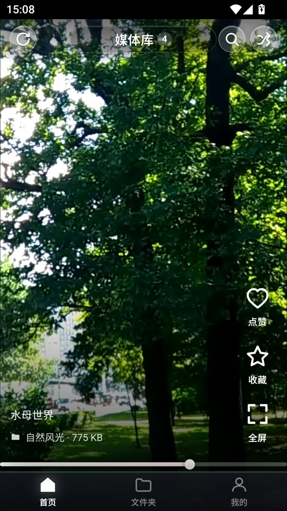
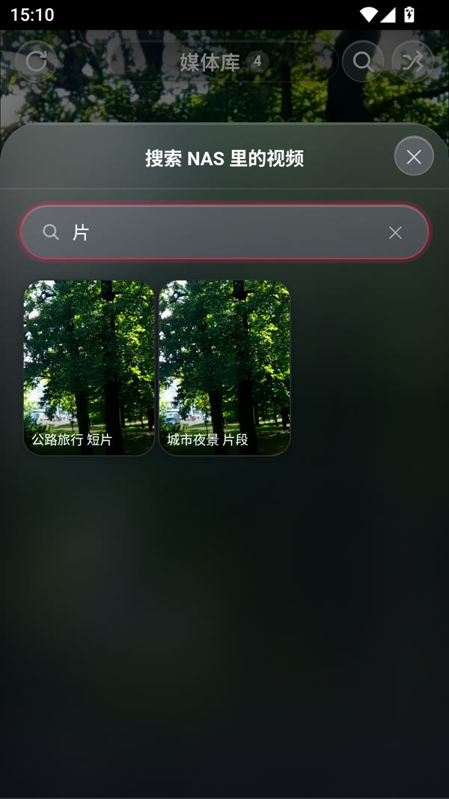
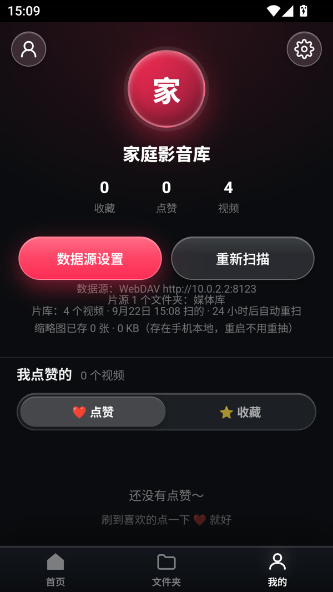
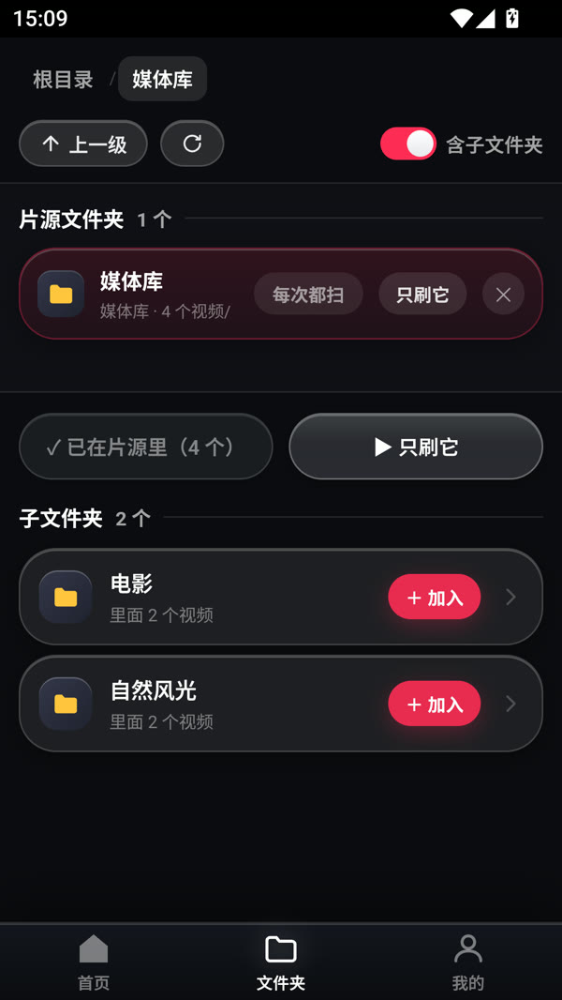

# NAS 短视频 · 抖音风格

把 NAS 里的片子，刷成抖音的样子。

手机、平板、电脑浏览器打开就能用，不需要给 NAS 装任何插件。
**零第三方依赖**，只用 Node 原生模块。

**三种装法**

| 用法 | 怎么开始 |
|---|---|
| 🖥 **浏览器**（电脑 / 手机 / 平板都行） | 双击 `start.bat`，浏览器自动打开 `http://localhost:8080` |
| 📱 **安卓 App** | 去 [**Releases**](https://github.com/xyyzz6/douyin-nas/releases) 下 APK，**不用自己编译** |
| 🐮 **飞牛 fnOS** | 同一个 Releases 下 `.fpk`，在「应用中心 → 手动安装应用」里选它，见 **[FNOS.md](FNOS.md)** |

> 安卓包分了两个 ABI，**装错会提示「应用未安装」**：
>
> | 文件名 | 给谁 | 体积 |
> |---|---|---|
> | `douyin-nas-arm64.apk` | **真机**（2017 年后的安卓手机基本都是 arm64） | ~27 MB |
> | `douyin-nas-x86_64.apk` | **模拟器**（MuMu / 雷电 / AVD 等） | ~29 MB |
>
> 不确定自己是哪种：`adb shell getprop ro.product.cpu.abi`，回 `arm64-v8a` 就下第一个。
> 两个包用同一个调试密钥签名，所以能互相覆盖安装；从别处装的包要先卸载再装。
> 想自己编译看第七节（需要 JDK 17 + Android SDK）。
>
> 飞牛那边是四个包（用途 × 机型各两个维度），挑法看 **[FNOS.md 第一节](FNOS.md#一选哪个包)**。

接 NAS 只有一种方式：**WebDAV**。填一次地址和账号密码，之后在应用里**逐层点目录**，
点哪层就刷哪层 —— 换文件夹不用再改配置。

---

## 一、它长什么样

竖屏全屏信息流，一屏一个视频，上下滑切换（跟抖音一样）：

<p align="center">
  
  &nbsp;
  
</p>

> 以上是**真机 APK 的实拍截图**（顶部那排是安卓状态栏）。
> 演示片源是几个公开测试短片 —— 这个系列全部影像都来自
> [Big Buck Bunny](https://peach.blender.org/)、花朵延时这类 CC 素材。

| 位置 | 内容 |
|---|---|
| 顶部 | ↻ 重启应用（左上角）/ 片源名 + 视频数 / 🔍 搜索 / 🔀 换一批（重新随机） |
| 右侧竖排 | ❤️ 点赞、⭐ 收藏、⛶ 全屏 |
| 左下 | 视频名字、📁 所在文件夹 + 文件大小；`.strm` 片子额外挂一个空心 **STRM** 小标 |
| 最底 | 播放进度条（可点击跳转） |
| 底部导航 | 首页 / 文件夹 / 我的（只留三个，收藏与点赞都收进「我的」） |

> 左下角原来还有一行 `@NAS` + 一个红色实底的「NAS」小标 —— 2026-09-20 按用户要求删掉了。
> 原因是**它是假的**：后端从来没有返回过作者字段，那行永远渲染成写死的 `@NAS`；
> 而那个实底标也永远亮着，看不出任何信息（你的片源其实是「本机 strm 库」，跟 NAS 无关）。
> 现在这一行只在片子是 `.strm` 时出现，且只挂一个**有信息量**的空心「STRM」标 ——
> 它的意思是「这条是外链，不是网盘里的实体视频」。
>
> 顶栏中间那行是**纯静态标题**（片源名 + 数字角标），点它不会发生任何事 ——
> 早先它挂过一个 ⌄ 小箭头、暗示「点开能切换片源」，但从来没有绑过事件；
> 和已删的 ☰「菜单」按钮属于同一类假按钮，2026-09-18 一并清掉了。
> 顶部的视频数**只显示个数**（如「73 个视频」），不显示 NAS 地址与目录路径 ——
> 一是长路径会把徽标撑出屏幕，二是截图分享时容易漏出内网地址。
> 想看自己接的是哪台 NAS，去「我的」页的数据源信息。

**「我的」页长什么样**

<p align="center">
  
</p>

> 收藏和点赞**都放在「我的」页里**，不再占用底部导航的位置。
> 三个统计数字（收藏 / 点赞 / 视频）都是按钮：点收藏 → 收藏列表，点点赞 → 点赞列表，点视频 → 回首页信息流。
> 头像和昵称在「数据源设置」里改；下面那几行是**只读的数据源信息**（这张截图接的是一个本地测试源）。

> **这是一个纯粹的私有视频浏览器，不是社交产品。** 抖音里那些社交与装饰元素一律没做：
> 头像+关注、关注/推荐双 Tab、分享、旋转唱片、♫ 原声配乐，以及**评论**。
> 右栏只保留三个真正用得上的动作：**点赞**、**收藏**、**全屏**。

**交互**
- 上下滑动 / 方向键 ↑↓ 切换视频，自动播放当前、暂停其他
- **刷的顺序是随机的**：每次打开 App 重新洗牌，不会永远从第一个文件开始。
  顶栏那个 🔀 按钮是 **「换一批」**，点一下整条流重新洗牌、从头开始刷。
  已经排好的顺序在一次使用中**不会自己变**——后台悄悄补扫到新片时，老片原地不动、新片接在后面
- **左上角 ↻ = 重启应用**：把整个应用重新加载一遍（APK 里是重建页面并重启本机服务，
  浏览器里是重新载入页面）。界面卡住、状态不对劲的时候，点它等于「重开一次」。
  按下后按钮会转圈 —— 到页面真正重载之间有个几百毫秒的空档，转圈是给这个空档的反馈。
  想**让片库跟着 NAS 变**是另一件事，那个入口在「我的」页的「重新扫描」（见第五节）

  > 早期版本这里做过「下拉刷新」（在首页顶部往下拽触发），**2026-09-18 按用户要求整体删掉了**。
  > 原因不只是「用不上」：`.feed` 是 `overflow-y:scroll` 的原生滚动容器，要把下拉手势抢到 JS 里，
  > 就得给它挂 `touch-action:none`，代价是浏览器原生竖向滚动一起没了 ——
  > 只能再用 `pager*` 那套函数按 `scroll-snap-stop:always` 的语义自己实现翻页。
  > 为一个刷新动作拖上整条手势链不划算，所以连 `pager*` 一并删掉：
  > 现在 `.feed` 用 `touch-action:pan-y`，竖向翻页交回浏览器原生 scroll-snap（合成器线程，主线程忙也不掉帧）。
  > `check.js` 里有十几条反向断言盯着，别把下拉刷新或 `pager*` 加回来。
- **单击**画面暂停 / 播放，**双击**画面点赞（爱心从点击位置炸开 + 震动）
- **长按画面 = 2 倍速播放**：按住约 0.4 秒开始加速，画面上会出现「2.0x 倍速播放中」角标，**松手立刻回到 1 倍**。
  手指一旦滑动超过 12 像素就当成「想划走」，不会误触发加速。手机上想快速过掉一段、电脑上按住鼠标左键都行
- **⛶ 全屏播放**：画面铺满整个浏览器窗口（跳出手机外框），在窗口里按 `Z` 也能进
- **退出全屏**：全屏后**右上角常驻两个按钮**——「沉浸全屏」（再点一次进/退系统级全屏）和红色的「退出」
- **进度条能拖**：按住进度条上的**圆点**左右拖，进度跟着手指走，**松手才真正跳转**（依赖后端 Range 透传，秒开不卡顿）。
  只点一下也能跳。条做得比一般播放器粗（5px，拖的时候变 8px），圆点**常显**（手机上本来就没有 hover，以前等于没有抓点），
  整条触摸热区 30px 高 —— 手指按下去不容易偏。手指滑出进度条甚至滑出屏幕也还能接着拖
- 首次进入默认静音（浏览器自动播放限制），点顶部红色条开启声音
- 视频旁边只有前后各 2 个在预加载，几百个视频也不卡
- 片库**一天只完整扫一次**：之后再打开直接用缓存，秒出列表（见第五节）

### 深色 / 浅色主题

**「我的」页右上角 ⚙️ → 设置** 里有一行 **外观**：`深色 | 浅色 | 跟随系统`。默认**深色**，改完立刻生效，不用重启。

| 档位 | 行为 |
|---|---|
| 深色 | 一直黑底（原来的样子） |
| 浅色 | 界面变白：设置 / 我的 / 文件夹 / 搜索 / 各种面板 / **底部导航** |
| 跟随系统 | 跟着手机系统的深浅色走，系统切换时界面**立刻**跟着变 |

**浅色只换「界面」，首页刷视频那块永远是黑底。** 视频是按比例 `contain` 全屏的，四周留白一旦变白
会非常刺眼，而且刷片本来就该是沉浸式黑底。

**顶部那一行（↻ / 片源名 / 🔍 / 🔀）两个主题下都保持深色。** 它是压在画面上的悬浮层，
做成白色实底等于在视频顶上贴一条硬边白板；深色渐隐才能融进画面。
**底部导航则是跟随主题的** —— 它在页面最底下、压不到画面主体，浅色下是一条浅色栏。
两者的区别不在「压不压在视频上」，而在「在页面边缘还是浮在画面中间」。

设置存在浏览器 / App 本地（`nasdy.theme`），**不进 `/api/config`**：它不改变扫描行为，
而且走配置就得等一次全量重扫（实测 54~185 秒）才生效。

> 两个实现上的坑，改这块之前先看一眼：
> ① 安卓状态栏颜色只能由**原生**改（`MainActivity.applySystemBarTheme`），网页里的
> `<meta name="theme-color">` 对 WebView 无效 —— 不然浅色界面顶上会永远留一条黑边。
> ② 「跟随系统」这一档**必须问原生**：Android WebView 的 `prefers-color-scheme` 取自
> **App 自己的主题**（本项目是深色主题），跟系统设置毫无关系 —— 实测把系统切成浅色，
> 网页里 `matchMedia('(prefers-color-scheme: light)').matches` 依然是 `false`。
> 只靠媒体查询的话这一档会**永远停在深色**，等于假的。

### 液态玻璃视觉系统（2026-09-22 升级）

界面是「苹果液态玻璃」风格。这次升级把整套视觉语言收敛到 `public/css/style.css` 顶部
`:root` 的令牌区，再按下面这套**两套配方**去套组件。

**玻璃分两种配方，取决于它下面压的是什么 —— 这是本项目唯一一条不能违背的视觉规则：**

| 配方 | 用在哪 | 怎么做 | 为什么 |
|---|---|---|---|
| **面板玻璃** | 各种 `.sheet` 面板、抽屉、卡片、按钮、输入框 | `backdrop-filter: var(--blur)` 真模糊 + `--sheen` 顶部高光 + `--specular` 斜向镜面 | 背后是**静止**的界面，只栅格化一次，便宜 |
| **浮层玻璃** | 顶栏图标、底部导航、模式徽标、播放器按钮、遮罩 | 半透明底 + 1px 亮边 + **上亮下暗**的内高光（`box-shadow` 三层） | 背后是**正在播放的视频**，`backdrop-filter` 会让合成器每帧重新取一次那块视频做模糊 —— 实测这是卡顿头号原因，而且主线程是空闲的，JS 剖面根本查不出来 |

`check.js` 对第二条有**负向断言**：`.tabbar / .mode-badge / .mask / .tb-icon / .player-btn`
的规则体里出现 `backdrop-filter` 就变红。别再往它们上面加。

**新增的令牌**（都写在 `:root` 里，原有的 87 个一条没动）：

| 令牌 | 作用 |
|---|---|
| `--glass-3` / `--glass-4` | 玻璃再补两档。原来只有 `.08/.13`，「常态 → 浮起 → 选中」三层做不出来 |
| `--glass-dark-3` | 接近实底的深玻璃（抽屉那种最厚的） |
| `--specular` | **斜向镜面**。苹果那套最显眼的不是顶部横高光，而是一束从左上斜切到右下的水光 |
| `--blur-thin` / `--blur-strong` | 细工具栏用 8px、厚面板用 40px，不再只有 16/26 两档可用 |
| `--r-xl`(32) / `--r-xs`(8) | 面板顶角从 24 提到 32 |
| `--dur-fast` / `--dur` / `--dur-slow` | 时长令牌，缓动曲线仍是那三条苹果弹簧曲线 |
| `--sh-sm` / `--sh-md` / `--sh-lg` | 投影阶梯。原来十几个组件各写各的 `box-shadow`，现在收敛成三档 |
| `--sh-hi` / `--sh-hi-b` | 「上亮下暗」那两层内高光。⚠️ 不叫 `--sh-in` —— 那个名字被开关槽的内阴影占着 |
| `--brand-hi` / `--brand-glow` / `--gold` / `--green` | 品牌色的高光/辉光，以及金色、绿色 |
| `--ink-2` / `--ink-3` | 界面文字的次级层级（压在视频上的那批继续用硬编码，见上面主题那节） |
| `--font` | 字体栈（补了 HarmonyOS Sans SC / Noto Sans SC，安卓上中文更稳） |

**浅色主题照旧只覆盖变量值**，新令牌也在 `html[data-theme="light"]` 块里补了对应值 ——
一条组件规则都没重写。唯一的例外是 `--specular`：它在深色下是半透明白，浅色下**仍然是白**
（它模拟的是一束打在玻璃上的光，改成深色就成污渍了）。

**要回退**：删掉 `:root` 里那段「液态玻璃 v2 补充令牌」+ 浅色块里对应的那几行，
再把用到它们的地方还原即可 —— 老令牌一个没动，所以不存在「回退到一半颜色错乱」。

**效果图**在 `_shots/ui-v2/`（11 张，780×1688 @2x，深浅两套）+ 4 张真机截图（MuMu 1080×1920）。
重新出图：

```bash
NODE_PATH="<node workspace>/node_modules" node _tmp/ui-shot.js
```

`_tmp/ui-preview.html` 是预览台：它**直接加载生产的那份 `style.css`**，不复制样式 ——
所以预览里看到的和真机是同一套。只补了 `--safe-t/--safe-b`（桌面 headless 里 `env()` 恒为 0）
和一条模拟系统状态栏。想看别的场景加 `?scene=home|settings|config|browse|me&theme=light&scroll=760`。

---

## 二、连接你的 NAS

进 **「我的 → 数据源设置」**，设置页分成 4 步（APK 版有第 1 步；PC / 浏览器版没有内置引擎，直接从第 2 步开始）：

| 步骤 | 干什么 |
|---|---|
| 1. 内置网盘 | 手机本地跑 CloudDrive2 引擎，**完全不碰 NAS**（APK 专属，见本节末） |
| 2. 登录到 WebDAV 服务器 | 填地址 + 账号密码，真连一次服务器 |
| 3. 选择要刷的文件夹 | 进「文件夹」页，用 ＋ 把目录加为片源 |
| 4. `.strm` 自动库 | 可选：把视频清单生成成 `.strm` 文件（给 Emby / Jellyfin 用），见第四节末 |

**第一步：登录**

| 字段 | 说明 |
|---|---|
| WebDAV 服务地址 | NAS 的 WebDAV 地址，带 `http://` 和端口 |
| 用户名 / 密码 | NAS 的登录账号（密码留空 = 不修改） |

填完点 **「登录」**，它会拿这组地址账号**真连一次**服务器。连上了，第二步的文件夹选择才解锁 ——
这样就不会出现「配置推下去、扫描报一堆看不懂的错」。

**第二步：选择要刷的文件夹**

「要刷哪些文件夹」**不用手敲** —— 点 **「浏览 NAS 目录…」** 进「文件夹」页，一层层点着加。

**第一次连的推荐流程**

1. 填地址和账号密码 → 点 **「登录」**
2. 登录成功后点 **「浏览 NAS 目录…」** 跳到 **「文件夹」** 页，从 NAS 根目录开始一层层点进去
3. 找到放片的目录，按它右侧的 **「＋ 加入」**，或者进到目录里按 **「＋ 加入片源」**
4. 想再加第二个、第三个文件夹就重复第 2、3 步 —— **片源可以是好几个文件夹的合集**
5. 点底部 **「首页」** 标签回首页开刷（改完片源会自动起后台扫描，不用再点别的按钮）

想验证地址对不对，点第二步里的 **「测试」**，它会告诉你这个目录下有几个子文件夹、几个视频。

### 多个文件夹一起刷

首页刷的**不是一个目录，而是一组「片源文件夹」**。比如「电影」和「剧集」分别在 NAS 的两处，
把两个都加进片源，首页就会把它们混在一条信息流里。

- **片源区**在「文件夹」页最上面，列出当前加好的文件夹：每行有 **「只刷它」**（临时只看这一个）和 **「✕」**（移出片源）
- **重复、嵌套没关系**：同时加了父目录和子目录，重复的视频会自动去掉，不会出现两遍
- **某个片源挂了不影响别的**：其中一个被删掉/改名/掉线，只跳过它，其他文件夹照常刷，界面上会有提示
- **不限制片源个数**：加多少都行（重复、嵌套会自动去重），只是加太多扫一轮会慢
- 设置页里的「要刷哪些文件夹」也会把这份清单列出来（只读，增删都在「文件夹」页做）

### 文件夹页怎么用

<p align="center">
  
</p>

- **片源区**在最上面，列出当前加好的文件夹（每行有「只刷它」和「✕」）
- 中间那行是**面包屑**（`根目录 / 媒体库`），点任意一级跳回去；右边是「↑ 上一级」「↻ 刷新」和**「含子文件夹」**开关
- 下面按 **子文件夹** / **本层视频** 两段列出来，每行的「里面 N 个视频」是**异步数的**（目录先出来，数量随后补上）
- **点文件夹行** = 进去看看
- **点右侧「＋ 加入」** = 把这个文件夹加进片源（已经在片源里的会显示「✓ 已加」）
- **「＋ 加入片源」**（顶部大按钮）= 把**当前这一层**加进片源
- **「▶ 只刷它」** = 把片源临时换成只有这一个并回首页（原来加的那些会被替换掉）
- **「含子文件夹」关掉** = 这次扫描只算当前这一层
- 片源会被记住：下次打开应用还是这几个文件夹；重开「文件夹」页就落在上次待的目录上

### 不想碰 NAS？用内置网盘（只有 APK 版有）

APK 里**自带 CloudDrive2 官方引擎**（手机本地的网盘聚合服务，从 CD2 安卓 APK 提取的
原生二进制，**不用另外安装 CloudDrive2 App**），
所以你可以完全不用 NAS：**App → 本机 127.0.0.1:19798/dav → 网盘**。

进「我的 → 数据源设置」，最上面那块就是它：

1. 点 **「打开 CloudDrive2 管理」** → 登录你的 **CD2 账号** → 在里面挂载网盘
   （115 / 115open / 夸克 / 阿里云盘 / 123 / 百度 / 迅雷 / GoogleDrive / OneDrive…）

   > 💡 CD2 引擎模拟各家网盘**官方客户端协议**（尤其 115 风控最少），
   > 这是换掉内置 Alist 的根本原因 —— Alist 走 115 老接口太容易被风控。
   > CD2 用 115open（115 官方开放接口）时按官方配额走，几乎不触发风控。
2. 回来点 **「用它当数据源」** → 地址自动填 `http://127.0.0.1:19798/dav`
   → 账号密码填**同一组 CD2 账号** → 点「登录」
3. 之后的操作和连 NAS 时**完全一样**：进「文件夹」页挑目录 → 加进片源 → 回首页刷

> ⚠️ WebDAV 的账号密码就是你的 **CD2 账号**（引擎的 Basic 认证）。
> 引擎监听本机端口，管理页和 WebDAV 由 CD2 账号保护，**别设太弱的密码**。
>
> 📦 安装包体积：引擎约 22MB（arm64），APK 约 **25MB** —— 比内置 Alist 时代（~95MB）小一大截。
>
> 🗑️ 项目早期试过「内置 115 直连」（手写官方接口），2026-09-19 已**整体删除**；
> 同日内置 Alist（OpenList）也**整体移除**，换成 CloudDrive2 官方引擎。
> App 只认标准 WebDAV 一条路，接哪个网盘由引擎决定。

### 各家 NAS 怎么填

| NAS | 服务地址 |
|---|---|
| 群晖 Synology | `http://192.168.1.100:5005` |
| 威联通 QNAP | `http://192.168.1.100:8080` 或 `https://...:8081` |
| 绿联 / 极空间 / 铁威马 | 设置里开启 WebDAV，一般 `http://IP:5005` |
| Nextcloud | `https://你的域名`（地址里的路径会自动带上） |
| 群晖 + 115 / 夸克等网盘 | 先用 CD2/CloudDrive 之类把网盘挂进群晖，再用上面那条 WebDAV 地址 |

> 群晖要先去 **控制面板 → 文件服务 → WebDAV** 把服务打开。
> 局域网建议用 `http`，`https` 的自签证书容易被浏览器拦。

---

### 手机上刷

启动时终端会打印局域网地址，例如：

```
本机访问：  http://localhost:8080
手机访问：  http://192.168.1.136:8080   （同一 WiFi 下）
```

手机浏览器打开这个地址就行。想要更像 App，三条路：

- **iOS Safari**：分享 → 添加到主屏幕
- **Android Chrome**：菜单 → 添加到主屏幕
- **装 APK**（Android 专属，最接近原生 App）：见 **第七节**

之后从桌面图标打开就是全屏无地址栏，跟原生 App 一样。

---

## 三、功能清单

- ✅ **多设备同步（可选）**：多台设备登同一个账号（服务端就跑在你自己 NAS 上），**点赞 / 收藏 / 坏码流名单 / 昵称头像 / 片源与监控清单**自动对齐；strm 备份包也能存进账号，新设备登录后自动恢复 —— 换机再也不用手动导 zip。**不配这一项也照常用**，数据只在本机。部署与用法见 **[SYNC.md](SYNC.md)**
- 🆕 **飞牛 fnOS 应用包（.fpk）**：服务端可打包成飞牛应用，应用中心「手动安装」即可，桌面图标点开就用，x86 与 ARM 两种机型都有包。见 **[FNOS.md](FNOS.md)**
- ✅ **WebDAV 连接**：PROPFIND 浏览与扫描，支持中文 / 空格文件名、Basic 鉴权
- ✅ **文件夹浏览选片**：从 NAS 根目录逐层点进去，面包屑任意跳级，一眼看到每个文件夹里有几个视频
- ✅ **多个片源文件夹**：首页刷的是**一组文件夹的合集**，重复 / 嵌套自动去重，某个片源挂了不影响别的（见第二节）
- ✅ **片库一天只完整扫一次**：扫完落盘（PC 版 `data/library.json`，APK 版 App 私有目录 `files/library.json`），之后打开应用**直接读盘上的缓存、秒出列表**，不再连 NAS 重扫；缓存过期了也是先用旧列表、后台悄悄重扫
- ✅ **长按画面 2 倍速**：按住约 0.4 秒开始加速，松手立刻回 1 倍
- ✅ **进度条可拖动**：条加粗到 5px、圆点常显、触摸热区 30px；**拖动中只跟手画、松手才 seek**（转码流每次跳都要重启一路 ffmpeg，边拖边跳会闪黑 —— 这是 PC 版转码时的情况；APK 是原文件直通、原生 seek，拖到哪儿是哪儿）
- ✅ **递归范围可控**：文件夹页的「含子文件夹」开关直接决定这次扫多深；设置里还有最大深度
- ✅ **抖音式信息流**：CSS scroll-snap 全屏吸附，一屏一个视频
- ✅ **刷的顺序随机**：每次打开 App 都重新洗牌；顶栏 🔀「换一批」可随时重排。刷的过程中顺序稳定不变，后台补扫到的新片接在后面，正在看的那条不会被甩走
- ✅ **顶栏 ↻ 一键重启应用**：左上角那个按钮，按一下把整个应用重新加载一遍（APK 走原生重建，浏览器走 `location.reload()`）。已在雷电模拟器上验证：点击后界面完整重载、本机服务重新起在 8099、片库正常回来
- ✅ **点赞**：右栏 ❤️ 或**双击画面**，爱心炸开 + 震动；`L` 键也行
- ✅ **收藏 / 点赞都能翻出来看**：都在「我的」页里，顶部分两段（❤️ 点赞 / ⭐ 收藏，**默认先看点赞**），九宫格缩略图点开就是全屏播放；「我的」页的收藏数 / 点赞数 / 视频数也都是按钮，点一下直达对应列表
- ✅ **点赞视频带缩略图**：列表里每条都显示一帧画面（默认取第 60 秒，短片自动退到 1/4 处），一眼能认出是哪个片子。抽帧在**点赞的那一刻**就在后台做掉了，翻列表时图已经是现成的，不用现场等
- ✅ **缩略图存在独立文件夹、重启不重抽**：生成的图落在 App 私有目录 `filesDir/thumbs/`（PC 版是 `data/thumbs/`），文件名是 `sha1(版本+视频路径).jpg`。App 重开、手机重启都不会重抽一遍；只有抽帧逻辑改了（版本号 +1）才会整套失效重做。「我的」页会显示「缩略图 N 张 · X MB · 存本机，重启免重抽」
- ✅ **全屏播放与退出**：右栏 ⛶ / 快捷键 `Z` 铺满窗口；右上角常驻「沉浸全屏」和红色「退出」两个按钮，再点 ⛶ 可进系统级全屏（连浏览器地址栏一起隐藏），`Esc` 也能退出
- ✅ **我的页**：昵称、视频数、收藏数、点赞数、当前 NAS 目录，以及内嵌的收藏 / 点赞列表
- ✅ **底部导航只留三个**：首页 / 文件夹 / 我的 —— 收藏和点赞收进「我的」，省掉一个没必要的 tab
- ✅ **搜索**：本地过滤片名 / 文件夹名
- ✅ **断点拖动**：后端透传 HTTP Range，大文件秒开、可随意拖
- ✅ **内置网盘（APK 专属）**：手机本地跑一个 **CloudDrive2 官方引擎**，「我的 → 数据源设置」里点两下就能直接刷网盘，**完全不需要 NAS**（见第二节末）
- ✅ **管理页密码可固定**：自己设一个就一直是它（内置库被重建也会自动改回去），不用记随机串。也可随时「随机重置」，两者互斥
- ✅ **片库只列能直接播的格式**：白名单固定为 mp4 / m4v / mov / webm / ogv / mkv / flv / ts / 3gp（`.strm` 也算）。avi / wmv / rmvb / mpg / mpeg 这类封装系统解码器解不了，**扫描时直接跳过、根本不进片库** —— 而不是列出来再让用户点进去失败。想在手机上看它们，先把片子转成 MP4 放回 NAS
- ✅ **缓冲够了再播**：先攒几秒再起播，且只预热下一条 —— 修掉了手机上「播两秒卡一下」
- ✅ **深色 / 浅色主题**：「我的」页右上角 **⚙️ → 设置** 里的 **外观** 一行，三档 `深色 / 浅色 / 跟随系统`，默认深色、改完立刻生效。浅色只换界面（设置 / 我的 / 文件夹 / 搜索 / 面板 / **底栏**），**首页刷视频那块永远是黑底**；顶部那一行两个主题下都保持深色（它浮在画面上）。见第一节末
- ✅ **演示模式**：没连 NAS 时用内置演示视频，先看效果
- ✅ **响应式**：手机全屏；电脑上渲染成手机外框，方便预览调试
- ✅ **扫描保护**：目录太大时（比如直接扫 NAS 根）45 秒或 800 个视频后自动收尾，并提示"只载入了前 N 个"

点赞和收藏都存在本地 `data/state.json` 和浏览器里，重启不丢。

### 缩略图是怎么做的

点赞视频的缩略图由**服务端抽一帧、落盘缓存**，而不是让浏览器现拉流现 seek —— 后者每翻一次列表就要对着 NAS 重新开一路流、跳一次位置，又慢又费带宽。

| 决策 | 怎么定的 | 为什么 |
|---|---|---|
| 抽帧用什么 | **APK 版：Android 自带的 `MediaMetadataRetriever`**<br>PC 版：外挂 ffmpeg | 系统自带解码器对 h264/mp4 完全够用，**APK 体积零增长**（当时 8401→8405 KB，只多了自己那几个 class）。抽帧不需要 ffmpeg，所以 2026-09-18 把转码能力整体拿掉之后，这一块**没动** |
| 取哪一帧 | 第 **60 秒**；片子比 60 秒短就退到 1/4 处 | 跳过片头，直接看正片；短片硬 seek 到 60s 会越界抽不到帧 |
| 怎么避免抽到黑屏 / 过场 | 在基准点附近取 **3 个候选帧**（-5s / 0 / +5s），各算一次**亮度标准差**，选最大的那张 | 纯黑、纯色、淡入淡出的画面标准差很低，会被自动淘汰；实测 4 条片子抽出来的都是清晰画面 |
| 存哪 | APK：`filesDir/thumbs/`（**不是** `cacheDir`）<br>PC：`data/thumbs/` | `cacheDir` 会被系统在存储紧张时直接清掉，缩略图要长期留着 |
| 文件名 | `sha1(版本号 + 视频路径).jpg` | 抽帧逻辑或取帧时间点改了，就把版本号 +1，整套旧图自动作废重抽 |
| 什么时候生成 | **点赞的瞬间**就排进后台队列（单线程串行，不抢带宽） | 翻列表时图已经是现成的。取消点赞**不删图** —— 很可能马上又点回来，重抽一次要连 NAS 读流，不划算 |
| 哪些还没图 | 打开 App、「我的」页时会自动把**已点赞/已收藏但还没有图**的排进队列补齐 | 老数据不用手动点。每次最多排 30 条、10 分钟才补一次，不会把 NAS 带宽占满 |
| 一直失败怎么办 | 同一条累计失败 3 次就不再重试 | 比如文件在 NAS 上已经被删了，无限重试只是白耗流量。**只有「真失败」才计数** —— 文件被删、解码不了这类；「引擎还没起来」不算（见下一行） |
| **引擎还没起来就抽帧失败** | **不算失败，退避后自动重试**（1s → 3s → 6s → 9s → 11s，累计约 30s） | App 启动时本机服务比内置引擎**早约 680ms** 就绪，这期间抽帧必然连不上。旧版把这种「连接被拒」也计入 3 次上限 → **点赞列表里永远显示 ⚠️ 破图标**。现在这类瞬时错误单独退避、**不消耗**那 3 次机会（2026-09-20 修）。退避累计必须 ≥ 30s（`MainActivity.CD2_BOOT_MS` 就是引擎的冷启动窗口），只贴近 20 多秒的话会出现「有时还是没图」 |
| 写盘原子性 | 先写 `.part` 临时文件，写完再 `rename` | 中途被杀 / 断电不会留下半张图，被后面的请求当成有效缓存 |

> **为什么抽帧没用 ffmpeg（当初的权衡，结论仍然成立）**：抽帧只需要「跳到某一秒、取一帧」，
> 系统自带的 `MediaMetadataRetriever` 就能做，而且对 h264/mp4 完全够用 ——
> 没必要为一个功能往 APK 里塞解码器。这条判断在 2026-09-18 转码改造之后依然有效：
> **转码搬去 NAS 了，抽帧还留在手机本地**，因为搬过去只是多一次网络往返、没有任何好处。

### 刻意不做的功能

| 没做 | 原因 |
|---|---|
| 评论 | 单机看片没有讨论场景 |
| 关注 / 关注 Tab | 库里的"作者"其实就是文件夹名，关注它没有意义 |
| 分享 | 片源在你自己 NAS 上，分享链接对别人不可用 |
| 音乐条 / 旋转唱片 | 本地视频没有"原声"配乐，纯装饰 |

> 点赞和收藏都是**纯粹的开 / 关状态**，不显示"9991 人赞过"这类编造的数字——
> 一个人看的私有片库，数字没有意义。

---

## 四、目录结构

```
douyin-nas/
├── start.bat              双击启动（Windows）
├── server.js              后端：WebDAV 浏览 / 扫描 + 拉流 + 点赞收藏（零依赖）
├── check.js               一致性自检：HTML/JS/CSS 引用、标签配对、接口是否都在
├── fetch-samples.js       可选：抓几个公开测试视频当演示素材
├── test-webdav.js         可选：端到端自测（内置一个模拟 NAS，67 项）
├── health.js              可选：一键体检（静态资源 / 接口 / 拉流 / 点赞收藏）
├── bin/                   可选：把 ffmpeg.exe / ffprobe.exe 放这里（**只对 PC 版有效**）
│                          用于 PC 版的转码与探时长；APK 版完全不用它（见第八节）
├── decode-server/         ⚠️ 已弃用（2026-09-18 用户要求整体回退）：原是跑在 NAS 上的
│   │                      Docker 转码容器，APK 已与它完全解耦，代码留在仓库里仅供参照
│   ├── server.js          服务本体（零 npm 依赖，边转边吐 mp4）
│   ├── Dockerfile         基于 jrottenberg/ffmpeg:7.1-ubuntu + Node 22
│   ├── docker-compose.yml 端口 8099 + WebDAV 环境变量 + 硬件透传（注释）
│   ├── selftest.js        不开 Docker 也能自测（字节计数可信）
│   └── README.md          部署 / 调参 / 排错
├── android/               可选：打包 Android APK 的工程与脚本（见第七节）
│   ├── build.js           一键打包：aapt2 → javac → d8 → zipalign → apksigner
│   ├── jniLibs/<abi>/     **内置 CloudDrive2 引擎**的安卓二进制（libclouddrive.so，约 22MB）
│   │                      ⚠️ 用 --abi= 选（默认 arm64-v8a；模拟器用 x86_64）
│   │                      ⚠️ 只能放这里 —— Android 10+ 应用私有目录是 W^X，只有
│   │                         nativeLibraryDir 允许执行；配套 manifest 必须开 extractNativeLibs
│   ├── AndroidManifest.xml / src/ / res/    工程本体（手写，不需要 Gradle）
│   │   └── src/com/nas/douyin/Thumbs.java   缩略图抽帧 + 独立目录落盘缓存
│   ├── lib/               打包自用的零依赖工具：ZIP 读写、PNG 编码
│   └── debug.keystore     签名密钥（首次打包自动生成；覆盖安装要一直用它，别删）
├── data/
│   ├── config.json        NAS 连接配置 + 片源文件夹列表（密码存在这里，别外传）
│   ├── library.json       片库扫描缓存（一天有效，删掉只会触发一次重扫）
│   ├── state.json         点赞 / 收藏记录
│   └── thumbs/            缩略图缓存（PC 版；删掉只会重抽一次，不影响功能）
└── public/
    ├── index.html
    ├── css/style.css      抖音风格样式
    ├── js/api.js          接口封装 + 小工具
    ├── js/app.js          信息流 + 片源文件夹 + 交互逻辑
    └── samples/           演示视频
```

> ★ 2026-09-18：`android/assets/ffmpeg/`（30MB）和 `Ffmpeg.java` **已删除**，
> 转码能力整体回退（为什么这么定，见第八节）。
> ★ 2026-09-19：115 网盘直连支持整体移除（`Pan115.java` / `P115Crypt.java` 及配套测试已删），
> **APK 现在只走 WebDAV 一条路，体积 2.1MB**。

**仓库里没有的东西**（都在 `.gitignore` 里，体积大或属于本机数据）：

| 路径 | 为什么没进库 | 怎么补 |
|---|---|---|
| `data/` | 含你的 WebDAV 密码、片库路径与观看记录 | 首次运行自动创建，在应用里填一次即可 |
| `bin/` | ffmpeg.exe / ffprobe.exe（约 196MB） | **可选**，只有 PC 版转码与探时长用得到；从 ffmpeg 官网下载丢进去 |
| `android/jniLibs/` | 预编译的 `libclouddrive.so`（两 ABI 共 46MB） | **可选**，只有用 APK 里「内置网盘」功能才需要 |
| `fnos/.cache/` `fnos/build/` `fnos/dist/` | 打包时下载的 Node 运行时与产物（约 550MB） | 跑 `fnos/build.mjs` 会自动重新下载 |
| `android/build/` `android/dist/` `*.apk` | 打包产物 | 跑 `node android/build.js` 生成 |
| `fnos/tools/` | 官方 fnpack.exe（打包工具） | 从飞牛官方下载 |
| `_tmp/` `_shots/` `_backup/` | 调试脚本、截图存档、历史备份 | 不需要 |

> 也就是说：**只 clone 本仓库就能跑起网页版**（`node server.js`），
> 不需要任何 npm install —— 这个项目是零第三方依赖的。
> 打 APK 需要 JDK 17 + Android SDK（build-tools 34 / platform 34），见第七节。

**为什么要有后端？**
浏览器直连 WebDAV 会撞 CORS（绝大多数 NAS 都不给跨域头）。中间加一层本机转发就完全绕开了，
顺带还能把密码留在服务端、把 Range 请求原样透传，并且让「列出目录」和「拉流」都走同一套鉴权。

**路径是怎么算的？**
应用内部统一用「相对 WebDAV 服务地址的完整路径」来标识目录和文件，比如 `/video/2024/a.mp4`。
它和 PROPFIND 返回的 `href` 是同一个坐标系，所以你在文件夹页点到的目录，可以直接拿去除以扫描 ——
不需要你再去设置里抄一遍路径。地址里带路径的写法（如 Nextcloud 的
`https://域名/remote.php/dav/files/用户名`）也会被自动识别。

**安全性**：拉流接口只放行视频扩展名，路径里的 `..` 会被归一化消掉（出不了 NAS 上的目录）；
服务默认只监听本机局域网，不做公网暴露（要暴露请自己加一层登录）。

---

### `.strm` 自动库（设置页第 4 步）

媒体服务器（Emby / Jellyfin）每次刷新媒体库都会把自己那棵目录树**递归列一遍**。
如果片源在网盘上，这种持续递归很容易触发风控。

这一块的思路是：让 App 定期把片单做成**一堆只有一行文本的 `.strm` 文件**，
媒体服务器只读这些小文本、不再自己去列网盘 —— 从「别扫」变成「少而准地扫」。

| 字段 | 说明 |
|---|---|
| 保存位置 | **固定**在 App 内（`Android/data/com.nas.douyin/files/strm`），**不用填、不用授权** |
| 监控这些文件夹 | **任意文件夹都行**（不限于第 3 步的片源），点「＋ 添加文件夹」浏览挑选，**可多选** |
| 自动扫描间隔 | 仅手动 / 每 1 / 3 / 6 / 12 / 24 小时 —— **间隔越小越容易触发风控** |

> 💡 「＋ 添加文件夹」每次都**从网盘根目录开始**（不是从你上次选的位置）——
> 这样哪一层都够得到，随便点进去一层，「✓ 选这个文件夹」就把它加进清单。

点 **「立即生成」** 起一次后台任务，跑完自动停（几百个片要几分钟）；
进度会显示在下面那行状态里。

> 💡 **增量**：只重建新增 / 变动的，跑过一次之后再跑就很快；**首轮全量稍慢**。
> 💡 清单里每个文件夹可以点 ✕ 单独拿掉 —— 只影响这个清单，**不会动第 3 步的片源**。
> ⚠️ `.strm` 播放时再去解析内容直连，所以**第一次打开会稍慢**（要读一次 `.strm` 内容）。
> **缩略图能出**：本机 strm 库里的片子会照常抽帧（走本地 `/api/stream`，不用直连网盘）——
> 2026-09-20 之前这里有个 bug，整条本机片源的缩略图都被误拦了，表现为「点赞列表全是 ⚠️」。
> 至于 **WebDAV 片源**上的 `.strm`，仍然不抽帧：那是为了不为了张缩略图去打网盘 API（防风控）。

**生成完之后，App 自己就能播这些 `.strm`**（不用拷给 Emby）。
第一次生成成功后，App 会自动把 `.strm` 所在目录加成一条片源，名字叫
**「本机 strm 库」**，出现在首页片源栏和「我的」页里：

- 这条片源是**自动加的、不给删**（它就是 `.strm` 的存放位置本身）；
- 里面列出的是 `.strm` 文件，点开就播 —— 播放时实时读 `.strm` 内容、直连网盘；
- 换机 / 换文件夹都不用重配：它记的是**相对位置**，不是你这台手机的绝对路径；
- 这条片源的扫描**固定全量递归**，不吃「含子文件夹 / 最大深度」设置 —— `.strm` 目录是
  App 自己写的，落点比源目录整体多一层，套同一个深度会把最深处一层**静默漏掉**
  （2026-09-23 修过：换机恢复 5271 个只显示 2176 个，就是深度 4 截的）。

> 💡 也可以照旧把整个 `strm` 目录拷给 Emby / Jellyfin 当媒体库目录。
> 用手机数据线连电脑，`.strm` 就在 `Android/data/com.nas.douyin/files/strm` 里。

> ⚠️ 电脑版（`server.js`）**不会**出现「本机 strm 库」—— PC 上没有手机存储，
> 它只管连 NAS 那一路。

---

## 五、常见问题

**「文件夹」页打不开，提示连不上？**
- `NAS 拒绝了连接` → **端口写错了**。这是最常见的一个：群晖 WebDAV 是 **5005**（http）/ **5006**（https），
  不是 500 也不是 5000
- `认证失败` → 账号或密码不对（401），改过密码要重新填
- `连接超时` → NAS 没开机，或防火墙 / 路由器拦了
- 先去设置页点「测试」，它会把真实错误原因翻成人话告诉你

**文件夹页里看不到我想找的共享文件夹？**
文件夹页是从 NAS 的 WebDAV 根开始的，根下面列出来的就是你的共享文件夹（群晖是 vol / 共享名，
Alist 是 `/dav/网盘名`）。如果某层点进去是空的，多半是那个目录确实没有视频，看「里面 N 个视频」那行。

**扫出来是空的？**
1. 「含子文件夹」**默认就是开的**（要只扫当前这一层就把它关掉）
2. 别直接扫 NAS 根目录：`DOCKER`、备份这类目录很吃时间。服务会在 45 秒或 800 个视频后收尾并提示，
   **更好的做法是把目录指到放片的那个文件夹**
3. `.mkv` `.avi` `.rmvb` 这类封装系统 / 浏览器解不了，**根本不进片库** —— 白名单固定为
   mp4 / m4v / mov / webm / ogv，没有开关可关（2026-09-18 把「仅保留浏览器能播的格式」开关删掉了，
   留着它等于又把解不了的格式放回首页）。想在手机上看它们，先把片子转成 MP4 放回 NAS

**NAS 上目录很多，翻起来慢？**
每列的「里面 N 个视频」是单独一次请求、并发 4 个、最多数 24 个，数不出来就显示「子文件夹」，
不会卡住界面。

**每次打开 App 都要重新扫一遍 NAS 吗？**
不用。扫描结果会落盘（PC 版是 `data/library.json`，APK 里是 App 私有目录的 `files/library.json`），
**24 小时内**再打开直接读缓存，列表秒出 ——
NAS 没开机、人不在家里也照样能看到上次的片单（点开播才需要 NAS 在线）。

这条对 **APK 同样适用**：缓存是在 App 启动、服务监听端口之前就同步读回来的，
所以打开就是现成列表。（早期版本片库只存在内存里，App 一重启就得全量重扫，
一次 70 个视频要 10 秒左右 —— 现在实测降到 **0 秒**。）

超过 24 小时了也不会让你干等：**先把旧列表拿出来用**，同时在后台悄悄扫一遍，
扫完自动换上新的。列表条数没变时不会重建页面，所以你正在看的视频不会跳位。

想立刻强制重扫：进「我的」页点「**重新扫描**」（这一下会同步等最新结果），
或删掉缓存文件再开应用。改了片源文件夹或连接信息，缓存会自动作废并重扫。

**片源栏里多了个「本机 strm 库」，是怎么回事？**
这是**自动加的**，删不掉，也不该删 —— 它就是 `.strm` 生成目录本身。详见第四节
「`.strm` 自动库」：生成成功后 App 会把那个目录加成一条独立片源，
于是**不用拷给 Emby，App 里就能直接点播自己的 `.strm`**。
它和你的 NAS 片源是两条并行的路；不想看它，把「设置 → `.strm` 自动库」关掉即可。

**我把片源全删了，为什么「我的」页还写着「片源 1 个文件夹」？**
早期版本的 bug，**已修**（2026-09-20）：「文件夹」页和「我的」页当时各读一个变量，
删完只更新了其中一个，不重启就一直显示旧的。
现在两页都以同一份数据为准，删完立刻同步显示「还没添加」。
如果还遇到，说明装的是旧包，装最新 APK 即可。

**avi / wmv / mkv 怎么不见了？**

因为**它们压根不会出现在片库里**。片库白名单固定为 **mp4 / m4v / mov / webm / ogv** ——
这些是系统 / 浏览器自带解码器能直接播的封装；avi / wmv / mkv / rmvb 是另外的容器格式，
浏览器里没有对应的解封装器 —— 跟码率、权限、NAS 都没关系，换播放器内核也没用。

与其把它们列出来、再让人点进去卡住，不如一开始就不列（2026-09-18 定下的做法，理由见第八节）。

想在自己的应用里看到它们，只有两条路：

1. **先把片子转成 MP4 放回 NAS**（推荐，转一次永久受益）：

   ```bash
   ffmpeg -i in.mkv -c copy -movflags +faststart out.mp4     # 内部本来就是 H.264/AAC 时只换封装，几秒钟
   ffmpeg -i in.avi -c:v libx264 -crf 20 -c:a aac out.mp4    # 编码也老（MPEG-4 / WMV / VC-1）时才真重编
   ```

2. **用 VLC / PotPlayer 直接打开 NAS 上的原文件**（不经过本应用）。

> 📌 **PC 版另外保留了一条本机转码的路**：把 `ffmpeg.exe` / `ffprobe.exe` 拷进 `douyin-nas/bin/`
> （下载 https://www.gyan.dev/ffmpeg/builds/ 的 `release-essentials`），PC 版就会用它转码 / 探时长，
> 即 `server.js` 的 `/api/transcode` 是**真转码**。
> ⚠️ **手机版没有这条路**：APK 里没有 ffmpeg、也不连任何转码服务，
> 它上报的 `ffmpeg` 字段**恒为 `false`**，只做原文件直通（详见第八节）。
> 同一个 `app.js` 靠这个字段分流 —— 所以「电脑上能转、手机上不能转」是**预期行为**，不是 bug。

> **（只在 PC 版真转码时才有这个问题）** 转码流是**拼接出来**的，没有完整文件那样的时间轴索引，
> 所以不能直接拖进度条 —— 做法是拖动时从目标位置重新起一路转码，会有几秒等待。
> 手机上没有这个问题：APK 走原文件直通、天然支持 HTTP Range，**拖进度就是原生 seek，不用等**（见第八节）。

**转码要等好几秒才出画面？**

> ⚠️ **这一节只对 PC 版（本机 ffmpeg 转码）有效。** 手机端不转码，点开就是原文件直通、
> 没有这段等待 —— 这也是当初把转码能力从 APK 里整体拿掉的原因之一（见第八节）。

「边转边播」意味着点开的一瞬间，ffmpeg 得先把远端文件「打开」——读头部、找关键帧、定位索引。
这一步在本地磁盘上几乎无感，但在网盘远程挂载上会被放大很多。本机实测（115 远程挂载）已经做过这几件事：

| 优化项 | 说明 | 实测效果 |
| --- | --- | --- |
| `-multiple_requests 1` | 复用同一条 TCP 连接。不开的话 ffmpeg **每 seek 一次就重连一次**，而云盘挂载建连一次要好几秒 | 关键项，配合下面两项一起用 |
| `-short_seek_size 1M` | 跨度很小时宁可顺序多读 1MB，也别断开重连去 seek。局域网下多读 1MB 只要几十毫秒 | 同上 |
| `-use_odml 0`（仅 avi） | AVI 的 OpenDML 超级索引压在**文件末尾**，默认会跑去读它，在云盘上等于绕一大圈。关掉后靠顺序扫描就能正常解 | avi 首字节 **8.2s → 4.7s**（中位数） |
| 列表加载后台预热 | 片库一出来就在后台把这些「需要转码」的文件的编码信息问一遍，服务端缓存住，等真划到就不用冷探测 | 省掉最长约 6 秒的冷探测 |

开画耗时参考（115 远程挂载，1080p 片源，本机实测）：

| 格式 | 内部编码 | 转码方式 | 首字节 |
| --- | --- | --- | --- |
| mkv | H.264 + AAC | 换封装（几乎不耗 CPU）| **约 1.0s** |
| wmv | VC-1 + WMA Pro | 重编码 | **约 0.6s** |
| mkv | HEVC + AAC | 重编码 | **约 0.2~1.4s** |
| avi | MPEG-4 + MP3 | 重编码 | **约 3~6s** |

avi 天生最慢：容器老了、索引结构对随机读取不友好，加上是重编码，所以明显比其他封装慢一截。
如果你的 avi 很多、又很在意开画速度，建议一次性转成 faststart 的 MP4 存到 NAS 上。

> **踩过的坑（供自己改代码时参考）**：ffmpeg 会「老实」地读 `HTTP_PROXY` / `HTTPS_PROXY` 环境变量。
> 如果系统里配了代理（公司终端、安全软件、开发环境的本地代理都算），ffmpeg 会把访问**内网 NAS** 的请求
> 也丢给那个代理，代理不认识这个地址就直接回 404。所以本项目在 spawn 子进程时会把代理变量全部摘掉
> （见 `server.js` 的 `childEnv()`）。现象是「时好时坏」——代理恰好没在跑时就正常，特别难查。

**手机上刷着刷着画面一顿一顿（抽搐）？**

按可能性从高到低：

1. **片源是「moov 在文件尾」的 MP4（非 faststart）**。这种文件浏览器必须先下几 MB 的索引表才能起播，
   每次切到新视频，那几 MB 都会把手机带宽吃满，正在播的那条就断断续续。
   判断方法：用 ffprobe 看，或者看文件头有没有 `moov`。彻底解决办法是重新封装一次（不重编码，几秒钟）：
   `ffmpeg -i in.mp4 -c copy -movflags +faststart out.mp4`
2. **模糊层拖累 GPU**。早期版本的底部导航带 `backdrop-filter: blur(14px)`，而它一直盖在播放中的视频上 ——
   手机每一帧都得重新模糊一遍，中低端机直接掉帧。现已去掉（底部本来就是 94% 不透明，视觉几乎没差别）。
3. **多条流抢带宽**。现在只预热下一条（原来是 i / i+1 / i+2 三条流一起拉），
   并且**先攒 5 秒缓冲再起播**，避免「播两秒卡一下、再追帧」的死循环。
4. **源站抖动**。如果你的 NAS 是 115 / 夸克这类网盘的「远程挂载」，实际链路是「网盘 → NAS → 本机 → 手机」，
   网盘限速会直接传导过来。片源码率 6 Mbps 的话，源头稳定供 0.75 MB/s 就够了。
5. **这片源本身就没编码好**（下一条，实战查过一例）。

**只有某几个视频一直卡，别的都好好的？——是文件自己的锅**

「一直卡、不是偶尔」和「只有几个文件」这两个特征同时出现，基本可以判定是**那个文件的视频码流本身**，
不是你的网络、NAS、手机或这个 App。下面是一例完整排查（1080p / H.264 Main / 5.76 Mbps / 2h34m 的 mp4）：

| 怀疑对象 | 怎么验的 | 结论 |
| --- | --- | --- |
| 网速不够 | 实测上游能给 40 MB/s，而片子只要 0.75 MB/s | ❌ 排除 |
| 多条流抢带宽 | 掐掉信息流其它流，只留这一条 | ❌ 排除 |
| 响应头 / 缓存策略 | 换 `Cache-Control` 反代对照 | ❌ 排除 |
| 容器 / 时序元数据 | `-c copy` 只重新封装 | ❌ 无效 |
| 音频拖累同步 | `-c copy -an` 去掉音轨 | ❌ 无效 |
| 解码能力 | 浏览器自报在用 `D3D11VideoDecoder` 硬解，媒体管线**零错误**；纯软解（`FFmpegVideoDecoder`）成本只有实时需求的 1/6 | ❌ 排除 |
| 分辨率 / 画面复杂度 | 同一段内容重编成 **720p**、以及重编成**同样 1080p** | ❌ 都正常 |
| AUD / 参数集抖动 | 用 `filter_units` 剥掉 AUD+SEI；SPS/PPS 在流内**逐字节一致** | ❌ 无效 |
| 帧时间戳 | 源片 29.97fps **严格 CFR**，相邻间隔抖动仅 0.001ms（比重编码还规整） | ❌ 排除 |

排除到最后只剩一条：**换流方式都不管用，换编码器立刻就正常**。同一段内容、同分辨率、同机器、同送流方式：

| | 实际上屏帧率 | 丢帧 | 「整帧未显示」（间隔 66.7ms）次数 |
| --- | --- | --- | --- |
| 原始码流 | **25.6 fps** | 15.2% | **48 次 / 281 帧** |
| 重新编码后 | **29.1 fps** | 1.7% | 2 次 |

也就是说，原始码流里大约**每 6 帧就有 1 帧从来没被显示出来**，画面在那一格被硬 hold 成两倍时长 —— 这就是眼睛看到的「抽一下」。
同一批片源里另外两个文件实测分别是 29.9 fps / 0 次 和 24.8 fps（原生 25fps）/ 4 次，**完全正常**，所以是个别文件的问题，不是通病。

**怎么办**：把这个文件重新编码一遍（改的是编码，不是封装，所以 `-c copy` 没用）：

```bash
ffmpeg -i in.mp4 -c:v libx264 -preset veryfast -crf 20 -pix_fmt yuv420p \
       -c:a aac -b:a 160k -movflags +faststart out.mp4
```

`+faststart` 顺手把索引挪到文件头，起播也会快一截。1080p 在这台机器上实测 7.5× 实时，2.5 小时的片子约 20 分钟跑完。

> 应急的替代方案（**仅 PC 版有**）：把这条流走服务端转码也能得到**完全流畅**的画面（实测上屏 29.4 fps、丢帧 0/194），
> 代价是**起播要等约 12 秒**（远端探测 + ffmpeg 打开文件），所以只建议救急、不建议日常这么看。
> 手机端没有这个选项，只能按上面那条重新编码。

**能连上但打不开视频？**
- 看浏览器控制台的报错，多半是 NAS 的 WebDAV 只给了列表权限、没给读取权限
- 或者 NAS 上的权限没给这个共享文件夹

**视频加载慢？**
- 局域网一般没问题；外网访问 NAS 取决于你的上行带宽
- 4K 原盘用手机流量刷会很吃力，建议放 1080p 的片子，或者把目录指向转码后的版本

**想让局域网外也能刷？**
可以用 Tailscale / ZeroTier 之类的组网工具，或者把服务部署到能访问 NAS 的机器上。
⚠️ 如果要暴露到公网，务必自己加一层登录验证——这个服务本身没有鉴权。

**端口被占用？**
`set PORT=9000 && node server.js`（Windows）换个端口。

---

## 六、自测

```bash
node server.js          # 一个终端跑服务
node check.js           # 一致性自检：引用、标签、接口是否都对得上
node test-webdav.js     # 端到端联调（67 项）
node health.js          # 顺手体检：服务活着吗、接口通不通
```

- **`check.js`** 纯静态也能跑（服务没起就跳过运行时那段）。改完前端建议先过一遍：
  它会揪出「JS 里引用了 HTML 里不存在的 id」这类跨文件漏改，以及旧功能有没有删干净。
  它还会把 `app.js` 里的洗牌函数**抠出来真跑一遍**，验证「条数不丢不重 / 200 次洗牌真随机 /
  同一批内容二次传入顺序不变 / 新增与掉线视频不会打乱已有顺序」。
- **`test-webdav.js`** 会临时起一个「模拟 NAS」，把目录浏览、面包屑、子目录视频计数、
  按目录刷、递归开关、中文 / 空格文件名、401 鉴权、Range 拉流、路径穿越防护、
  点赞与收藏持久化跑一遍；多片源的**合并 / 包含去重 / 坏片源隔离**，
  以及片库**缓存的命中、`scannedAt` 稳定、`peek` 版本比对**也都有覆盖。
- **跑 `test-webdav.js` 不会弄丢你的 NAS 配置，也不用你重扫**：它在启动时把 `data/config.json` 和
  `data/library.json`（片库缓存）都读进内存快照，测完通过 `POST /api/config` 原样还回去，
  并断言「地址一致 + 密码还在 + 片源文件夹也还在」，最后把缓存重建好再报结果。
  （走接口而不是直接改文件，是因为服务端配置常驻内存。）万一中途 Ctrl+C 打断没还原，
  重新启动服务即可让内存与磁盘重新对齐。

---

## 七、打包成 Android App（APK）

想让安卓手机上是「真·App」而不是「浏览器加了书签」，可以用 `android/` 里的脚本打一个 APK 装上去。

### 这个 APK 是什么

**它是一个薄壳**：原生的全屏窗口 + 一个 WebView + 一个内置的本地 HTTP 服务。

> 📌 2026-09-18：**转码能力被整体拿掉**（原因见第八节）。
> 📌 2026-09-19：**内置 CloudDrive2 官方引擎** —— 手机本地的网盘聚合服务（安卓原生二进制），
> 于是「完全不连 NAS」成为可能。同日**移除了内置 Alist（OpenList）**（115 风控太频繁）。
> APK 约 **25MB**，见第二节末那一小块。

分工是：

```
手机（APK：本地服务 + WebView + 内置 CloudDrive2 引擎）  ←WLAN→  NAS（可选）
   直连 WebDAV 浏览 / 拉流 / 抽缩略图 / 探时长（全在手机本地做）
   内置引擎（127.0.0.1:19798）：直连网盘（115 / 夸克…），或者把 NAS 挂进来
   —— 不转码：mp4 / mkv / flv / ts / 3gp 等靠原生播放器直接播，
      avi / wmv / rmvb / mpg 扫描时直接跳过、不进片库（2026-09-19 用户要求）
```

好处是浏览器那套前端一个字都不用改，而且后端升级不用重装 App。

### 怎么打

需要 **JDK 17** 和 **Android SDK**（build-tools + platforms 各装一个即可）。
不需要 Gradle，也不需要 Android Studio。

```bash
node android/build.js
```

脚本会自己找 JDK 和 SDK（`JAVA_HOME` / `ANDROID_HOME`，或默认安装位置），
然后按 `aapt2 → javac → d8 → zipalign → apksigner` 走完，最后在项目根目录产出：

```
douyin-nas.apk
```

### 版本号：每次打包自动涨

**每跑一次 `build.js` 版本号就自动 +1，不用手动改** ——
版本名涨末位（`1.3` → `1.3.1` → `1.3.2` → …），版本号（系统判断「谁更新」的整数）每次 +1。

涨完之后会**写回 `android/build.js`**，所以下次从那继续涨，不会重复。

```bash
node android/build.js                        # 1.3.2 → 1.3.3，打包
node android/build.js --no-bump              # 保持 1.3.3，反复打同一个版本（调试用）
node android/build.js --version-name=1.4     # 手动起新基线：1.4（下一轮从 1.4.1 接着涨）
node android/build.js --version-code=100     # 单独指定版本号
```

包打好后，装到手机上在 **「我的」页底部**能看到当前版本（小字 `v1.3.3`）——
截图发我时我一眼就知道你装的是哪一版，不用猜。

**默认服务器地址是自动猜的**（取本机那个 `192.168.x.x` 的局域网地址 + 8080），
所以多数情况下打出来直接能用。想指定就带上参数：

```bash
node android/build.js --default-url=http://192.168.1.7:9000
node android/build.js --out=D:/douyin-nas.apk        # 换输出位置
node android/build.js --clean                        # 先清空 build/ 再打
```

> 打包过程中所有中间产物都在 `android/build/`，可以随时删。
> `android/debug.keystore` 是签名用的，**首次打包会自动生成，之后别删**——
> 换一个密钥再装就会提示「安装包签名不一致」，得先卸载旧版。

### 怎么装

**不想自己编译**：直接去 [**Releases**](https://github.com/xyyzz6/douyin-nas/releases) 下现成的包
（`arm64` 给真机、`x86_64` 给模拟器，见开头那张表）。

自己打出来的包在 `android/dist/`，两个 ABI 分开发布，**文件名带 ABI 就是提醒别装错**：

```bash
adb install -r android/dist/douyin-nas-arm64.apk      # 真机
adb install -r android/dist/douyin-nas-x86_64.apk     # 模拟器
```

> 装错 ABI 的表现是 **「应用未安装 / App not installed」** —— 包本身没问题，是这台设备装不了。

或者把 apk 拷到手机上点一下安装（需要在系统里允许「安装未知来源应用」）。

装完打开就是全屏的刷视频界面，没有地址栏、没有浏览器的各种按钮。

### 首次打开 / 换服务器

App 会直接去连打包时写进去的那个默认地址。**连不上（或地址变了）就自动弹出设置页**，
填一个地址点连接即可，格式是 `http://电脑IP:8080`（只写 `192.168.1.7:8080` 也行，会自动补 `http://`）。

地址会记住。之后想改：**按返回键 → 「服务器设置」**。返回键那个菜单里还有「重新加载」和「退出」。

### 这个壳做了什么

| 事情 | 说明 |
|---|---|
| 全屏视频 | 网页里点 ⛶ 进全屏时，由原生接管：**连状态栏和导航栏一起隐藏**，退出再还回来 |
| 自动播放 | 关掉了「必须先点一下才能播」的限制，划到哪条就播哪条 |
| 震动 | 双击点赞的震动需要 `VIBRATE` 权限，已申请 |
| 记住状态 | WebView 开着 DOM Storage，网页里的偏好能存下来 |
| 后台暂停 | 切到别的 App 会暂停解码，不偷跑流量 |
| 明文 http | 局域网基本是 http，而新系统默认禁明文，已在配置里显式放开（只信任系统证书） |
| 不跳浏览器 | 页面里所有跳转都留在 App 内，不会甩给系统浏览器 |
| 保持屏幕常亮 | 看片时不会自己熄屏 |

微信里那些「摇一摇」之类的东西一律没有——这个壳刻意做得很薄，改不了业务逻辑。
**页面本身长什么样，仍然由 `public/` 决定。**


### 自己验证一下（可选）

用模拟器验证比真机快，也不用数据线：

```bash
# 1. 起模拟器（无窗口也行，截图照样能截）
emulator -avd <你的AVD名> -no-window -no-audio -gpu swiftshader_indirect

# 2. 打包一个「服务器地址指向宿主机」的测试包
#    模拟器里 10.0.2.2 就是宿主机，所以能直接连上你本机的 8080
node android/build.js --default-url=http://10.0.2.2:8080 --out=android/build/emu-test.apk

# 3. 装 + 起 + 截图
adb install -r android/build/emu-test.apk
adb shell am start -n com.nas.douyin/.MainActivity
adb shell screencap -p /sdcard/s.png && adb pull /sdcard/s.png
```

想用桌面 Chrome 直接调 WebView 里的页面：开 `chrome://inspect`
（App 里开了 WebView 调试开关，方便排查连不上、样式不对这类问题）。

---

## 八、播放架构：单机自包含，靠原生解码 + 原生 seek

**2026-09-18 定稿。** 这一节讲清楚 APK 到底怎么播片、seek 怎么生效，
以及**为什么这里没有「转码服务」** —— 后一点尤其重要，别再把那套搬回来。

### 一句话版本

> **APK 是一台单机。** 它不转码、不带 ffmpeg、不连任何外部解码服务。
> 能播的片子靠系统原生解码直接播；播不了的（`avi` / `wmv` / `rmvb` 这类封装）
> **在扫描阶段就标灰**，点都点不进去。

### `/api/transcode` 是个「假转码」—— 但这是**有意**的

名字有误导性，先看它实际做什么：

```java
private Resp handleTranscode(Req req, Map<String, String> q) {
    Resp r = handleStream(req, q);          // ← 就是直通原文件
    if (r != null && r.status < 400) {
        r.headers.put("X-Seekable", "1");           // 「这个流原生可 seek」
        r.headers.put("X-Transcode", "passthrough"); // 「没转，是原文件」
    }
    return r;
}
```

`t` / `mode` / `h` / `q` 这些转码参数**会被忽略** —— 这是对的，不是 bug。

之所以还叫 `/api/transcode`，是因为前端在别的后端（PC 版）上要走同一条路径，
接口形状保持一致，前端不用分叉。

### seek 为什么「白捡」就能用

既然是原文件直通，那它**天然支持 HTTP Range**：
`handleStream` 会转发 `Range` 头、回 `Accept-Ranges: bytes`。
于是浏览器可以**原生 seek** —— 拖进度条只要改 `video.currentTime` 就行。

实测（模拟器，一个 4.28GB 的片）：

```
$ curl -D - -H 'Range: bytes=0-1000' 'http://127.0.0.1:8099/api/transcode?p=<片>&t=700'
HTTP/1.1 206 Status
Accept-Ranges: bytes
Content-Range: bytes 0-1000/4597738201      ← 从字节 0 开始（t=700 被忽略了，正确）
X-Transcode: passthrough
Content-Length: 1001
X-Seekable: 1                                ← 前端 canNativeSeek() 的依据
```

### 前端 seek 的三层逻辑（改之前先读懂）

用户抱怨过的两种现象 —— **「拖了没反应」** 和 **「无论怎么拖都从头开始」** ——
都出自这三层里某一层被改坏：

| 层 | 条件 | 动作 |
|---|---|---|
| 1 | `canNativeSeek(v)`：`seekable` 覆盖 **≥90%** 文件 | **只改 `v.currentTime`**，绝不碰 `src` |
| 2 | 有时长，但 `seekable` 还没铺开 | 记 `seekRetry`，**900ms** 后重判一次 |
| 3 | 还是不行 | `restartStream(i, at, total, item)` ← 唯一允许改 `src` 的地方 |

APK 上正常只走第 1 层。第 3 层是留给真·转码流（PC 版）的。

> ⚠️ **第 1 层里的 `t0` 必须归零。**
> `t0` 的语义是「这路流是从第几秒开始发的」。原生 seek 的流是**整条**发过来的，
> 起点就是 0。进度条按 `t0 + currentTime` 换算 —— 这里要是也写成 `target`，
> 就算成 `2×target`，进度条直接飞出屏幕。

### 各个后端的能力不一样，这是设计如此

| 后端 | 文件 | 有没有转码能力 | `/api/transcode` 干什么 |
|---|---|---|---|
| 手机版 | `android/src/com/nas/douyin/NasServer.java` | **没有** | **原文件直通** + `X-Seekable: 1` |
| PC 版 | `server.js`（Node） | 有（本地 ffmpeg，或配了远端就转发） | 真转码 |
| 解码服务 | `decode-server/server.js` | 有 | 真转码 |

**同一个 `app.js` 伺候所有后端**，靠后端上报的 `ffmpeg` 字段分流：
APK 恒 `false`（前端于是不做任何转码相关动作），PC 版可以是 `true`。

⚠️ 字段名里带 `ffmpeg` 但它问的是**「服务端有没有转码能力」**。
改名前先数一下引用点（十几处），别冲动。

### 相关字段（`GET /api/config` 的响应）

| 字段 | APK 的取值 | 含义 |
|---|---|---|
| `ffmpeg` | **恒 `false`** | 没有转码能力。**这是诚实的正确值**，别「修」成 true |
| `ffmpegPending` | `false` | 保留给老前端读，没有「正在置备」这回事了 |
| `decoder` | `"native"` | 播片靠系统原生解码 |
| `probe` | `true` | 支持 `/api/probe` 探时长 |
| ~~`decodeUrl`~~ | **不存在** | 整个字段删了 |
| ~~`ffmpegReason`~~ | **不存在** | 「没有转码能力」是常态，不是错误，不用解释 |

### 探测时长：读不出来就如实说

`/api/probe` 只走系统 `MediaMetadataRetriever`。它读不了 ASF/WMV 这类容器
（系统里根本没有那类解封装器），这时接口如实返回：

```json
{"ok": false, "error": "读不出时长"}
```

前端据此把这条片**标灰**。这正是我们想要的行为 ——
**宁可一开始就说不能播，也不要让用户点进去转半天才失败。**

### 为什么不做「远端解码服务」（这段历史别丢）

我们**真的做过**，见 [`decode-server/`](decode-server/)：一个跑在 NAS 上的 Docker 容器，
APK 只负责把请求转发过去。它**技术上完全可行**，而且解决了几个真问题：

- 手机转 1080p 只有 **0.37× 实时**（看 1 分钟等 2 分 40 秒）；
- 唯一现实的硬编选项 `h264_mediacodec` 常「进程活着、退出码 0、一帧不出」；
- 手机转码 = 发烫 + 掉电；
- 内嵌 ffmpeg + ffprobe 共 30MB，把 APK 从 11MB 撑到 40MB。

**但它的代价是：用户必须额外部署并长期维护一个容器**，还要在设置页填地址、
指望 NAS 一直在线。对「装上就能用」的单机场景，这是负担。

**用户 2026-09-18 明确要求整体回退，于是就这样定了。**
`decode-server/` 保留在仓库里做参考（它本身能用），但 APK 已完全解耦、不再提它。

### 想重新加上转码能力？

**不建议，但如果非要**，当成一个**新决策**来做，不要零敲碎打：

1. 决定转码跑在哪（本地内嵌 ffmpeg / 远端容器）；
2. 后端加回 `/api/transcode` 的真转码实现 + 能力探测接口；
3. 前端加回设置入口 + `S.ffmpeg` 分流写顺；
4. **把 `check.js` 里的反向断言一起改掉**（下面这些是**有意**的摩擦）。

`check.js` 与 `build.js` 里现在有一组**反向卡点**：

- 包里出现 `assets/ffmpeg/{ffmpeg,ffprobe}` → 构建直接 fail（防 30MB 悄悄回来）；
- 包里出现 `assets/samples/*.mp4` → 构建直接 fail（防 8.4MB 悄悄回来，见下）；
- APK 体积不在 1.5~3MB 区间 → `check.js` 红。

### 一个值得记住的体积回归

回退完成后 APK 是 **10,345.8 KB**，但预期只有 **8,413.8 KB** —— 差 1.9MB 对不上。
拆包包发现：`assets/samples/*.mp4` 五个演示片共 **8.4MB**，**占 APK 82%**。

它们只是 **PC 版**的演示片源（`server.js` 的 `DEMO_META` 列它们、`/samples/*` 流它们），
而 APK 侧 `demoPayload()` 返回的是**空数组** —— 手机端从来不提供演示片源。
**这 8.4MB 没有任何代码能取到。**

修法：`android/build.js` 里的 `ASSET_EXCLUDE_DIRS = ['samples/']` 把它们排除。
结果：**10,345.8 KB → 2,061.5 KB**。

> 这种「功能没变、体积翻五倍」的回归肉眼发现不了，
> 所以构建脚本现在会在包内出现这些大文件时**直接 fail**。
